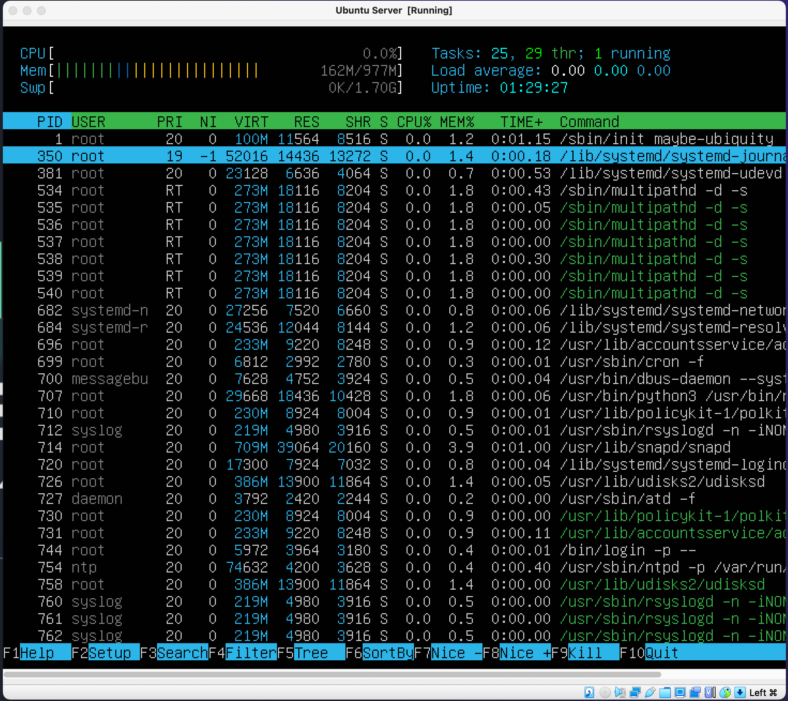

## Part 1. Установка ОС
- Установить **Ubuntu 20.04 Server LTS** без графического интерфейса. (Используем программу для виртуализации - VirtualBox)
- Графический интерфейс должен отсутствовать.
- Узнайте версию Ubuntu, выполнив команду \
`cat /etc/issue.`
- Вставьте скриншот с выводом команды.

## Part 2. Создание пользователя
- Создать пользователя, отличного от пользователя, который создавался при установке. Пользователь должен быть добавлен в группу `adm`.
- Вставьте скриншот вызова команды для создания пользователя.

- Новый пользователь должен быть в выводе команды \
`cat /etc/passwd`
- Вставьте скриншот с выводом команды.

## Part 3. Настройка сети ОС
- Задать название машины вида user-1. 
  
- Установить временную зону, соответствующую вашему текущему местоположению.

- Вывести названия сетевых интерфейсов с помощью консольной команды.

- В отчёте дать объяснение наличию интерфейса lo. 
  - Смысл этого интерефейса состоит в том, чтобы обеспечить сетевое соединение компьютера с самим собой. Что используется в основном для диагностики и работы с серверами запущенными на данной машине. Адрес интерфейса 127.0.0.1, маска 255.0.0.0, однако, практически, для идентификации устройства обычно используется только адрес 127.0.0.1.
- Используя консольную команду получить ip адрес устройства, на котором вы работаете, от DHCP сервера. 

- В отчёте дать расшифровку DHCP.  
  - DHCP - Dynamic Host Configuration Protocol — протокол динамической настройки узла. Служит для автоматического распределения ip-адресов в сети.
- Определить и вывести на экран внешний ip-адрес шлюза (ip)
  - 'curl ifconfig.me/ip'
- и внутренний IP-адрес шлюза, он же ip-адрес по умолчанию (gw). 
  - 'ip route show match 0/0'
- Задать статичные (заданные вручную, а не полученные от DHCP сервера) настройки ip, gw, dns (использовать публичный DNS серверы, например 1.1.1.1 или 8.8.8.8).  
- Перезагрузить виртуальную машину. Убедиться, что статичные сетевые настройки (ip, gw, dns) соответствуют заданным в предыдущем пункте.  

- Успешно пропинговать удаленные хосты 1.1.1.1 и ya.ru и вставить в отчёт скрин с выводом команды. В выводе команды должна быть фраза "0% packet loss".

## Part 4. Обновление ОС
- Обновить системные пакеты до последней на момент выполнения задания версии.  
- После обновления системных пакетов, если ввести команду обновления повторно, должно появится сообщение, что обновления отсутствуют.
- Вставить скриншот с этим сообщением в отчёт.

## Part 5. Использование команды **sudo**
- Разрешить пользователю, созданному в [Part 2](#part-2-создание-пользователя), выполнять команду sudo.

- В отчёте объяснить *истинное* назначение команды sudo (про то, что это слово - "волшебное", писать не стоит). 
  - Команда sudo ( substitute user and do, подменить пользователя и выполнить ) позволяет строго определенным пользователям выполнять указанные программы с административными привилегиями без ввода пароля суперпользователя root. Если быть точнее, то команда sudo позволяет выполнять программы от имени любого пользователя, но, если идентификатор или имя этого пользователя не указаны, то предполагается выполнение от имени суперпользователя root.
  
- Поменять hostname ОС от имени пользователя, созданного в пункте [Part 2](#part-2-создание-пользователя) (используя sudo). Вставить скрин с изменённым hostname в отчёт.

## Part 6. Установка и настройка службы времени
- Настроить службу автоматической синхронизации времени.  
- Вывести время, часового пояса, в котором вы сейчас находитесь.
- Вывод следующей команды должен содержать `NTPSynchronized=yes`: \
  `timedatectl show`
- Вставить скрины с корректным временем и выводом команды в отчёт.

## Part 7. Установка и использование текстовых редакторов 
- Установить текстовые редакторы **VIM** (+ любые два по желанию **NANO**, **MCEDIT**, **JOE** и т.д.)  
- Используя каждый из трех выбранных редакторов, создайте файл *test_X.txt*, где X -- название редактора, в котором создан файл. Напишите в нём свой никнейм, закройте файл с сохранением изменений.  
- В отчёт вставьте скриншоты:
  - Из каждого редактора с содержимым файла перед закрытием.

- В отчёте укажите, что сделали для выхода с сохранением изменений.
  - Vim - последовательность: 'Esc', ':wq'.
  - Mcedit - последовательность: 'F2', 'F10'
  - Nano - последовательность: '^O', '^X'
- Используя каждый из трех выбранных редакторов, откройте файл на редактирование, отредактируйте файл, заменив никнейм на строку "21 School 21", закройте файл без сохранения изменений.
- В отчёт вставьте скриншоты:
  - Из каждого редактора с содержимым файла после редактирования.

- В отчёте укажите, что сделали для выхода без сохранения изменений.
  - Vim - последовательность: 'Esc', ':q!'.
  - Mcedit - последовательность: 'F10', 'No'.
  - Nano - последовательность: '^X', 'n'.
- Используя каждый из трех выбранных редакторов, отредактируйте файл ещё раз (по аналогии с предыдущим пунктом), а затем освойте функции поиска по содержимому файла (слово) и замены слова на любое другое.
- В отчёт вставьте скриншоты:
  - Из каждого редактора с результатами поиска слова.
  - Из каждого редактора с командами, введёнными для замены слова на другое.
  - Результаты:
  - Mcedit

  - Vim. 
   - Команда поиска: '/search_pattern', следующее вхождение 'n', предыдущее 'N'.
   - Команды замены: 
    - 's/search_pattern/replace_pattern/' - замена первого вхождения в текущей строке
    - 's/search_pattern/replace_pattern/g' - замена всех вхождений в текущей строке
    - '%s/search_pattern/replace_pattern/g' - знак % перед s используется для замены во всем файле.

  - Nano.
   - Команда поиска: '^w', следующее вхождение 'Alt + w'
   - Замены: '^\\'

## Part 8. Установка и базовая настройка сервиса **SSHD**
- Установить службу SSHd.  
- Добавить автостарт службы при загрузке системы.  
- Перенастроить службу SSHd на порт 2022.  
- Используя команду ps, показать наличие процесса sshd. Для этого к команде нужно подобрать ключи.

- В отчёте объяснить значение команды и каждого ключа в ней.
 - Объяснение. Получить список всех процессов, выполняющихся в системах Linux и AIX, можно с помощью команды ps aux. Ключ а используется для отображения всех процессов, х — для отображения процессов, отсоединенных от термина­ла, а ключ u обеспечивает фильтрование по имени или идентификатору поль­зователя, который запустил программу.
- Перезагрузить систему.
- В отчёте опишите, что сделали для выполнения всех пяти пунктов (можно как текстом, так и скриншотами). Описание:
  - sudo apt-get update
  - sudo apt-get install openssh-server
  - sudo systemctl status ssh
  - sudo nano /etc/ssh/sshd_config - строка с указанием порта раскомментирована и порт заменен на 2022.
  - sudo systemctl restart sshd 
- Вывод команды netstat -tan должен содержать  \
`tcp 0 0 0.0.0.0:2022 0.0.0.0:* LISTEN`  \
(если команды netstat нет, то ее нужно установить)
- Скрин с выводом команды вставить в отчёт.

- В отчёте объяснить значение ключей -tan, значение каждого столбца вывода, значение 0.0.0.0. 
- Объяснение:
  - netstat (network statistics) — утилита командной строки, выводящая на дисплей состояние TCP-соединений (как входящих, так и исходящих), таблицы маршрутизации, число сетевых интерфейсов и сетевую статистику по протоколам.
  - t - используется для того, чтобы выделить активные TCP соединения
  - a или -all - выводит информацию о всех сокетах (об активных которые слушают порты и неактивных, которые не слушают).
  - n - Показывать сетевые адреса как числа. netstat обычно показывает адреса как символы. Эту опцию можно использовать с любым форматом показа.
 - Расшифровка таблицы:
  - PROTO - название протокола
  - Recv-Q - очередь данных на прием. Число в этом поле показывает, что приложение не считало данные, поступившие через сеть из буфера протокола.
  - Send-Q - очередь данных на отправку. Число в этом поле показывает, что данные поступили в буфер отправки, но еще не были переданы. Что может указывать на высокую загрузку сети.
  - Local Adress - адрес локальной машины и прослушиваемый порт. Значение 0.0.0.0 говорит о том, что порт слушается на всех сетевых интерфейсах. Значение 127.0.0.0 о том, что порт слушается внутри локальной машины.
  - Foreign Address - адрес и порт удаленной машины, с которой установлено соединение. '*' говорит о том, что порт не определен.
  - State - состояние порта LISTEN - слушается. Возможные состояния: 
   - CLOSE_WAIT - ожидание закрытия соединения.
   - CLOSED - соединение закрыто.
   - ESTABLISHED - соединение установлено.
   - LISTENING - ожидается соединение (слушается порт)
   - TIME_WAIT - превышение времени ответа.

## Part 9. Установка и использование утилит **top**, **htop**
- Установить и запустить утилиты top и htop.  
- По выводу команды top определить и написать в отчёте:

  - uptime: 37 min.
  - количество авторизованных пользователей: 1 user
  - общую загрузку системы: 0.0 
  - общее количество процессов: 101 
  - загрузку cpu: 0.0 us — пользовательские процессы; 0.3 sy — процессы ядра; 0.0 ni - время затраченное CPU на выполнение процессов с искусственно измененным приоритетом; 99.7 id — неиспользуемые ресурсы; 0.0 wa — операции ввода/вывода; 0.0 hi - время потраченное CPU на обслуживание аппаратных прерываний; 0.0 si - время потраченное CPU на обслуживание программных прерываний; 0.0 st - время CPU, "украденное" у данной виртуальной машины для обслуживания других виртуальных машин.  
  - загрузку памяти: 161.1 MiB used - всего 976.9, свободно 426.0, память под кэш и буферы ядра 389.7
  - pid процесса занимающего больше всего памяти: 714
  - pid процесса, занимающего больше всего процессорного времени: 1119

- В отчёт вставить скрин с выводом команды htop:
  - отсортированному по 
   - PID

   

   - PERCENT_CPU

    

   - PERCENT_MEM

 

   - TIME

   

  - отфильтрованному для процесса sshd

  - с процессом syslog, найденным, используя поиск 

  - с добавленным выводом hostname, clock и uptime  

## Part 10. Использование утилиты **fdisk**
- Запустить команду fdisk -l.
- В отчёте написать название жесткого диска, его размер и количество секторов, а также размер swap.
  - Название жесткого диска, на скриншоте - Disk Identifier
  - Размер - сумма размеров всех разделов, т.е. примерно 10 Гб.
  - Количество секторов - сумма количества секторов всех указанных разделов, т.е. 20967424.
  - Размер swap - 0. 

## Part 11. Использование утилиты **df** 
- Запустить команду df.  
- В отчёте написать для корневого раздела (/):
  - размер раздела: 9299276 Kb
  - размер занятого пространства: 4847732 Kb
  - размер свободного пространства: 3957568 Kb
  - процент использования: 56%
- Определить и написать в отчёт единицу измерения в выводе: блок размером в 1 Kb.

- Запустить команду df -Th.
- В отчёте написать для корневого раздела (/):
    - размер раздела: 8.9 Gb
    - размер занятого пространства: 4.7 Gb
    - размер свободного пространства: 3.8 Gb
    - процент использования: 56%
- Определить и написать в отчёт тип файловой системы для раздела: ext4

## Part 12. Использование утилиты **du**
- Запустить команду du. Вывести размер папок (в байтах, в человекочитаемом виде): 
 - /home

 - /var

 - /var/log 

 - Вывести размер всего содержимого в /var/log (не общее, а каждого вложенного элемента, используя *)

## Part 13. Установка и использование утилиты **ncdu**
- Установить утилиту ncdu.
- Вывести размер папок /home, /var

- /var/log

- Размеры должны примерно совпадать с полученными в [Part 12].
- В отчёт вставить скрины с выводом использованных команд.

## Part 14. Работа с системными журналами
- Открыть для просмотра:
 1. /var/log/dmesg
 2. /var/log/syslog
 3. /var/log/auth.log  
- Написать в отчёте время последней успешной авторизации, имя пользователя и метод входа в систему.

- Перезапустить службу SSHd.
- Вставить в отчёт скрин с сообщением о рестарте службы (искать в логах).

## Part 15. Использование планировщика заданий **CRON**
- Используя планировщик заданий, запустите команду uptime через каждые 2 минуты.
- Найти в системных журналах строчки (минимум две в заданном временном диапазоне) о выполнении.
- Вывести на экран список текущих заданий для CRON.
- Вставить в отчёт скрины со строчками о выполнении и списком текущих задач.

- Удалите все задания из планировщика заданий.
- В отчёт вставьте скрин со списком текущих заданий для CRON.

